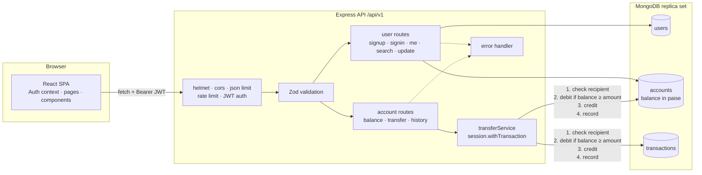

# PayTm Clone: Digital Wallet

A full-stack money-transfer app inspired by Paytm. Users sign up, get a wallet with a demo balance, search for other users and send them money instantly. Every transfer runs inside a **MongoDB multi-document transaction**, so balances stay correct even when many transfers happen at the same time.

**Stack:** React 19 + Vite + Tailwind CSS 4 (frontend), Node.js + Express 5 + Mongoose 9 + MongoDB (backend), JWT authentication, Zod validation.

## Features

- **Sign up / sign in** with email and password. Passwords are hashed with bcrypt, and sessions use expiring JWTs. Emails are case-insensitive.
- **Wallet balance** fetched from the API and kept in sync after every transfer.
- **User search** by first name, last name or email: debounced, case-insensitive, safe against regex injection, and never lists yourself.
- **Send money** with amount presets and an optional note. You get a receipt with a reference id and your new balance.
- **Correct transfers** using MongoDB transactions (sessions):
  - the debit, the credit and the transaction record are committed together, or not at all;
  - **insufficient balance** is rejected with a clear message and nothing changes;
  - **invalid recipients** (malformed id, unknown user, yourself) are rejected;
  - **concurrent transfers** can never overdraw an account: the debit is a conditional update (`balance >= amount`), and `withTransaction()` retries transient write conflicts.
- **Integer money**: balances are stored in paise (1 ₹ = 100 paise), so there is no floating-point drift. Amounts accept at most 2 decimals and are capped at ₹1,00,000 per transfer.
- **Transaction history** ("Recent activity") with direction, counterparty, note and time.
- **Profile update** (`PUT /api/v1/user`). Changing the password requires the current password.
- **Security basics**: Helmet headers, CORS allow-list, JSON body size limit, rate limiting on sign-in/sign-up, generic 500 responses that don't leak internal details, and secrets from environment variables only.
- **Responsive UI** with loading skeletons, empty states, inline validation, error alerts with retry, and automatic sign-out when a session expires.

## Architecture



**Transfer sequence** (all inside one transaction):

1. Validate the body: `to` must be a 24-character ObjectId, and `amount` must be positive, have at most 2 decimals and be at most ₹1,00,000.
2. Find the recipient's account, or return `404 Recipient not found`.
3. `findOneAndUpdate({ userId: sender, balance: { $gte: amount } }, { $inc: { balance: -amount } })`. If no document matches, return `400 Insufficient balance`.
4. `$inc` the recipient's balance and insert a `transactions` record.
5. Commit. Transient conflicts with other concurrent transfers are retried automatically by the driver.

## Project structure

```
PayTm/
├── package.json              # root scripts: install everything, run both apps
├── backend/
│   ├── src/
│   │   ├── server.js         # loads config, connects to MongoDB, starts HTTP server
│   │   ├── app.js            # Express app factory (used by tests too)
│   │   ├── config.js         # environment validation (Zod)
│   │   ├── db.js             # connection + replica-set check
│   │   ├── validation.js     # request schemas
│   │   ├── models/           # User, Account, Transaction
│   │   ├── routes/           # user.js, account.js
│   │   ├── services/         # authService, userService, transferService
│   │   ├── middleware/       # auth, validate, errorHandler
│   │   └── utils/            # money (paise), errors
│   ├── test/
│   │   ├── unit/             # validation, config, routes with mocked services/models
│   │   └── integration/      # real in-memory MongoDB replica set (mongodb-memory-server)
│   ├── .env.example
│   └── Dockerfile
├── frontend/
│   ├── src/
│   │   ├── api/client.js     # fetch wrapper, token storage, 401 handling
│   │   ├── auth/             # AuthContext, route guards
│   │   ├── components/       # header, balance card, user search, activity, UI kit
│   │   ├── pages/            # Signin, Signup, Dashboard, SendMoney, NotFound
│   │   └── utils/            # formatting (₹, dates) and validation
│   ├── vite.config.js        # dev proxy /api → :3000, Vitest config
│   ├── .env.example
│   └── Dockerfile + nginx.conf
├── docker-compose.yml
└── .github/workflows/ci.yml
```

## Prerequisites

- **Node.js 20.19+ or 22.12+** (the backend needs 20.12+, and Vite 8 needs 20.19+ or 22.12+)
- **MongoDB 6+ running as a replica set**, either local or MongoDB Atlas. See below.
- Optional: Docker with Docker Compose

## MongoDB replica set

MongoDB only supports multi-document transactions on **replica sets** (and sharded clusters). A plain `mongod` started without `--replSet` is a *standalone* server, and transfers fail with *"Transaction numbers are only allowed on a replica set member or mongos"*. The API detects this, logs a warning at startup, and returns a clear error message. A **single-node replica set** is enough for local development.

### Option A: MongoDB Atlas (no local install)

1. Create a free cluster at https://www.mongodb.com/atlas. Every Atlas cluster is a replica set.
2. Create a database user and allow your IP address under *Network Access*.
3. Copy the connection string and set it in `backend/.env`:
   ```ini
   MONGODB_URI=mongodb+srv://<user>:<password>@<cluster>.mongodb.net/paytm
   ```

### Option B: local single-node replica set

**Windows** (MongoDB Community Server installed as a service):

1. Open `C:\Program Files\MongoDB\Server\<version>\bin\mongod.cfg` as Administrator and add:
   ```yaml
   replication:
     replSetName: rs0
   ```
2. Restart the service: `net stop MongoDB` then `net start MongoDB` (in an Administrator terminal).
3. Initiate the replica set once (requires [mongosh](https://www.mongodb.com/try/download/shell)):
   ```powershell
   mongosh --eval "rs.initiate({ _id: 'rs0', members: [{ _id: 0, host: '127.0.0.1:27017' }] })"
   ```

Or, without the service, run it manually: `mongod --replSet rs0 --dbpath C:\data\rs0 --bind_ip 127.0.0.1` (create the folder first), then run the same `rs.initiate` command.

**Linux / macOS**:

```bash
# Linux (systemd): add the replication block above to /etc/mongod.conf, then
sudo systemctl restart mongod
# macOS (Homebrew): add the replication block to $(brew --prefix)/etc/mongod.conf, then
brew services restart mongodb-community

# or run it manually on either platform:
mkdir -p ~/data/rs0 && mongod --replSet rs0 --dbpath ~/data/rs0 --bind_ip 127.0.0.1

# initiate once:
mongosh --eval "rs.initiate({ _id: 'rs0', members: [{ _id: 0, host: '127.0.0.1:27017' }] })"
```

Check it with `mongosh --eval "rs.status().ok"` (should print `1`), and use:

```ini
MONGODB_URI=mongodb://127.0.0.1:27017/paytm?replicaSet=rs0
```

## Setup and run (without Docker)

### Windows (PowerShell)

```powershell
git clone https://github.com/iSouvikKhan/PayTm.git
cd PayTm
npm run install-dependencies          # installs root, backend and frontend packages
copy backend\.env.example backend\.env
# edit backend\.env: set MONGODB_URI and a random JWT_SECRET
npm start                             # backend on :3000, frontend on :5173
```

### Linux / macOS

```bash
git clone https://github.com/iSouvikKhan/PayTm.git
cd PayTm
npm run install-dependencies
cp backend/.env.example backend/.env
# edit backend/.env: set MONGODB_URI and a random JWT_SECRET
npm start
```

Generate a JWT secret with `node -e "console.log(require('crypto').randomBytes(32).toString('hex'))"`.

Open http://localhost:5173. The Vite dev server proxies `/api` to the backend on port 3000. To try a transfer, sign up two users (for example in a normal and a private browser window) and send money from one to the other.

Run the apps separately if you prefer:

```bash
cd backend && npm run dev     # restarts on changes
cd frontend && npm run dev
```

> **Upgrading from the previous version:** balances are now stored as integer paise and passwords as bcrypt hashes. Data created by the old version is not compatible, so use a fresh database (or drop the `users` and `accounts` collections).

## Running with Docker (optional)

```bash
# Linux/macOS
JWT_SECRET=$(node -e "console.log(require('crypto').randomBytes(32).toString('hex'))") docker compose up --build
```

```powershell
# Windows PowerShell
$env:JWT_SECRET = node -e "console.log(require('crypto').randomBytes(32).toString('hex'))"
docker compose up --build
```

- App: http://localhost:8080 (nginx serves the UI and proxies `/api`)
- API: http://localhost:3000
- MongoDB: `mongodb://localhost:27017/?replicaSet=rs0&directConnection=true`. Compose starts it with `--replSet rs0` and initiates the replica set automatically.

## Environment variables

Backend (`backend/.env`, see [`backend/.env.example`](backend/.env.example)):

| Variable | Required | Default | Description |
|---|---|---|---|
| `MONGODB_URI` | yes | none | MongoDB connection string. Must point to a replica set. |
| `JWT_SECRET` | yes | none | Secret for signing JWTs (at least 16 characters) |
| `JWT_EXPIRES_IN` | no | `1d` | Token lifetime (`jsonwebtoken` format, e.g. `12h`, `7d`) |
| `PORT` | no | `3000` | API port |
| `CORS_ORIGINS` | no | `http://localhost:5173` | Comma-separated allowed origins |
| `SIGNUP_BONUS_MIN` / `SIGNUP_BONUS_MAX` | no | `1000` / `10000` | Range of the random starting balance, in rupees |

The API refuses to start with a clear message if a required variable is missing or invalid.

Frontend (`frontend/.env`, optional):

| Variable | Default | Description |
|---|---|---|
| `VITE_API_URL` | empty (same origin) | API base URL when the UI is hosted separately |
| `VITE_PROXY_TARGET` | `http://localhost:3000` | Dev-server proxy target |

## API endpoints

Base path: `/api/v1`. "Auth" routes need `Authorization: Bearer <token>`. Amounts are in rupees.

| Method | Route | Auth | Description |
|---|---|---|---|
| `POST` | `/user/signup` | no | `{ username (email), password (8–72 chars), firstName, lastName }` → `201 { token, user, balance }`. `409` if the email exists. |
| `POST` | `/user/signin` | no | `{ username, password }` → `{ token, user }`. `401` on bad credentials. |
| `GET` | `/user/me` | yes | `{ user, balance }` |
| `PUT` | `/user` | yes | `{ firstName?, lastName?, password?, currentPassword? }` (current password required to change it) |
| `GET` | `/user/bulk?filter=<text>` | yes | `{ users: [{ id, username, firstName, lastName }] }`, max 20, excludes you |
| `GET` | `/account/balance` | yes | `{ balance }` |
| `POST` | `/account/transfer` | yes | `{ to: <userId>, amount, note? }` → `{ message, transactionId, amount, balance }` |
| `GET` | `/account/transactions?limit=20` | yes | `{ transactions: [{ id, direction, amount, note, createdAt, counterparty }] }` |
| `GET` | `/health` (no prefix) | no | `{ status, database }` |

Errors are JSON `{ "message": "...", "details": [{ "field", "message" }] }`. The status codes are: `400` validation or insufficient balance, `401` missing, invalid or expired token, `404` unknown recipient, `409` duplicate email, `429` too many sign-in/sign-up attempts, and `500` unexpected errors (with a generic message).

## Testing

```bash
cd backend
npm test                  # unit tests: validation, config, every route (services and models mocked)
npm run test:integration  # real MongoDB replica set in memory: transactions and concurrency
npm run lint

cd ../frontend
npm test                  # Vitest + Testing Library (fetch mocked)
npm run lint
npm run build
```

- **Unit tests** need no database. They cover input validation (negative, zero, oversized or 3-decimal amounts, bad ids), config errors, auth (missing, forged and expired tokens), rate limiting, error mapping and every route's contract.
- **Integration tests** start a single-node replica set with [mongodb-memory-server](https://github.com/typegoose/mongodb-memory-server). The first run downloads a MongoDB binary, which is large on Windows. They check bcrypt storage, case-insensitive login, duplicate sign-up without orphan accounts, the password change rule, safe search, atomic transfers, insufficient balance, invalid recipients, **20 concurrent transfers racing for the same balance** (exactly the affordable number succeed and nothing overdraws), and that the total amount of money is conserved under concurrent transfers in both directions.
- **Frontend tests** cover sign-in errors and redirect, dashboard data with empty states, automatic logout on an expired session, amount validation, a successful transfer receipt, server errors and a missing recipient.

CI (`.github/workflows/ci.yml`) runs all of the above on every push.

## Notes

This is a learning project with a simulated wallet. No real money or payment provider is involved.
